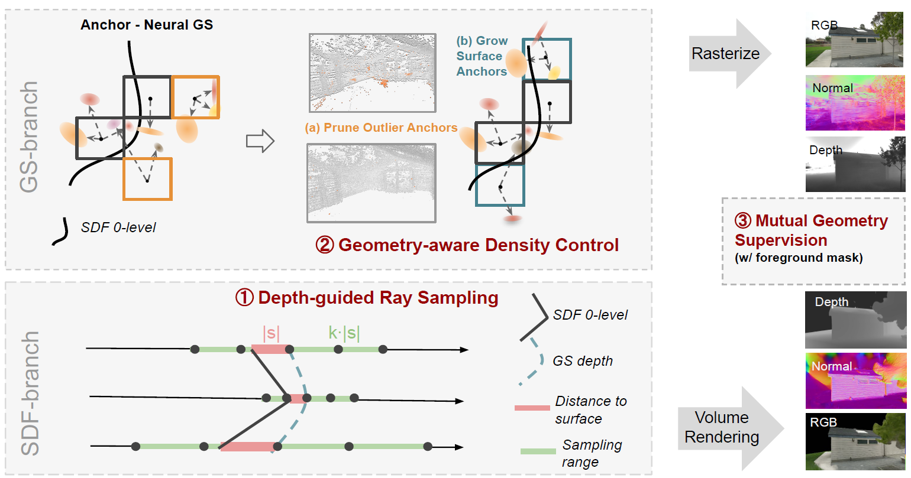

# GSDF: 3DGS Meets SDF for Improved Rendering and Reconstruction
[Mulin Yu*](https://scholar.google.com/citations?user=w0Od3hQAAAAJ), [Tao Lu*](https://github.com/inspirelt), [Linning Xu](https://eveneveno.github.io/lnxu), [Lihan Jiang](https://jianglh-whu.github.io/), [Yuanbo Xiangli](https://kam1107.github.io/)✉, [Bo Dai](https://daibo.info/) <br />

[[`Project Page`](https://city-super.github.io/GSDF/)][[`arxiv`](https://arxiv.org/abs/2403.16964)]


## Overview
<p align="center">

</p>

Representing 3D scenes from multiview images remains a core challenge in computer vision and graphics, requiring both reliable rendering and reconstruction, which often conflicts due to the mismatched prioritization of image quality over precise underlying scene geometry. Although both neural implicit surfaces and explicit Gaussian primitives have advanced with neural rendering techniques, current methods impose strict constraints on density fields or primitive shapes, which enhances the affinity for geometric reconstruction at the sacrifice of rendering quality. To address this dilemma, we introduce GSDF, a dual-branch architecture combining 3D Gaussian Splatting (3DGS) and neural Signed Distance Fields (SDF).
Our approach leverages mutual guidance and joint supervision during the training process to mutually enhance reconstruction and rendering. 
Specifically, our method guides the Gaussian primitives to locate near potential surfaces and accelerates the SDF convergence. This implicit mutual guidance ensures robustness and accuracy in both synthetic and real-world scenarios. Experimental results demonstrate that our method boosts the SDF optimization process to reconstruct more detailed geometry, while reducing floaters and blurry edge artifacts in rendering by aligning Gaussian primitives with the underlying geometry. 


## Installation

We tested on a server configured with Ubuntu 22.04, cuda 11.8 and gcc 11.4.0. Other similar configurations should also work, but we have not verified each one individually.

1. Clone this repo:
```
git clone https://github.com/city-super/GSDF.git --recursive
cd GSDF
```

2. Install dependencies
```
SET DISTUTILS_USE_SDK=1 # Windows only
conda env create --file environment.yml
conda activate gsdf
```

### Optional

To accelerate using [tiny-cuda-nn](https://github.com/NVlabs/tiny-cuda-nn.git), install it with 

```
pip install git+https://github.com/NVlabs/tiny-cuda-nn/#subdirectory=bindings/torch
```

and set 

```
self.use_tcnn = True # default is False for a higher quality
```

in ```gaussian_splatting/arguments/__init__.py```.

## Data

First, create a ```data/``` folder inside the project path by 
```
mkdir data
```

The data structure will be organised as follows:

```
data/
├── dataset_name
│   ├── scene1/
│   │   ├── images
│   │   │   ├── IMG_0.jpg
│   │   │   ├── IMG_1.jpg
│   │   │   ├── ...
│   │   ├── sparse/
│   │       └──0/
│   ├── scene2/
│   │   ├── images
│   │   │   ├── IMG_0.jpg
│   │   │   ├── IMG_1.jpg
│   │   │   ├── ...
│   │   ├── sparse/
│   │       └──0/
...
```


### Public Data

The MipNeRF360 scenes are provided by the paper author [here](https://jonbarron.info/mipnerf360/). And we test on scenes ```bicycle, bonsai, counter, garden, kitchen, room, stump```. The SfM data sets for Tanks&Temples and Deep Blending are hosted by 3D-Gaussian-Splatting [here](https://repo-sam.inria.fr/fungraph/3d-gaussian-splatting/datasets/input/tandt_db.zip). Download and uncompress them into the ```data/``` folder. The DTU scenes are downloaded from [here](https://drive.google.com/drive/folders/1SJFgt8qhQomHX55Q4xSvYE2C6-8tFll9).
### Custom Data

For custom data, you should process the image sequences with [Colmap](https://colmap.github.io/) to obtain the SfM points and camera poses. Then, place the results into ```data/``` folder.


## Training

### Training a single scene
For training a single scene, modify the path and configurations in ```train.sh``` accordingly and run it:
```
bash ./train.sh
```

- exp_dir: user-defined experiment directory;
- config: path of config file;
- gpu: specify the GPU id to run the code. '-1' denotes using the most idle GPU. 
- train/eval: training/eval mode;
- tag: user-defined experiment name.

This script will store the log (with running-time code) into ```outputs/${tag}``` (for GS branch) and ```exp/scenename/${tag}``` (for SDF branch) automatically.


<!-- ### Training multiple scenes

To train multiple scenes in parallel, we provide batch training scripts: 
 - Tanks&Temples: ```train_tnt.sh```
 - MipNeRF360: ```train_mip360.sh```
 - BungeeNeRF: ```train_bungee.sh```
 - Deep Blending: ```train_db.sh```

 > Notice 1: Make sure you have enough GPU card or memories to run these scenes at the same time.

 > Notice 2: Each process occupies many cpu cores, which may slow down the training process. Set ```torch.set_num_threads(32)``` accordingly in the ```train.py``` to alleviate it. -->

## Evaluation

### Rendering
We've integrated the rendering and metrics calculation process into the training code. So, when completing training, the ```rendering results```, ```fps``` and ```quality metrics``` will be printed automatically. And the rendering results will be save in the log dir. Mind that the ```fps``` is roughly estimated by 

```
torch.cuda.synchronize();t_start=time.time()
rendering...
torch.cuda.synchronize();t_end=time.time()
```

which may differ somewhat from the original 3D-GS, but it does not affect the analysis.

Meanwhile, we keep the manual rendering function with a similar usage of the counterpart in [3D-GS](https://github.com/graphdeco-inria/gaussian-splatting), one can run it by 

```
python render.py -m <path to trained model> # Generate renderings
python metrics.py -m <path to trained model> # Compute error metrics on renderings
```

### Reconstruction
For the geomtry reconstruction evaluation, please refer to [2DGS](https://github.com/hbb1/2d-gaussian-splatting?tab=readme-ov-file) for calculating the Chamfer Distance.

## Contact
- Mulin Yu: yumulin@pjlab.org.cn
- Tao Lu: taolu@smail.nju.edu.cn


## Citation

If you find our work helpful, please consider citing:

```bibtex
@article{yu2024gsdf,
  title={Gsdf: 3dgs meets sdf for improved rendering and reconstruction},
  author={Yu, Mulin and Lu, Tao and Xu, Linning and Jiang, Lihan and Xiangli, Yuanbo and Dai, Bo},
  journal={arXiv preprint arXiv:2403.16964},
  year={2024}
}
```

## LICENSE

Please follow the LICENSE of [3D-GS](https://github.com/graphdeco-inria/gaussian-splatting).

## Acknowledgement

The GS-branch is built based on [Scaffold-GS](https://github.com/city-super/Scaffold-GS) and the SDF-branch is built based on [Instant-NSR](https://github.com/bennyguo/instant-nsr-pl), we thank all the authors for the excellent work.
